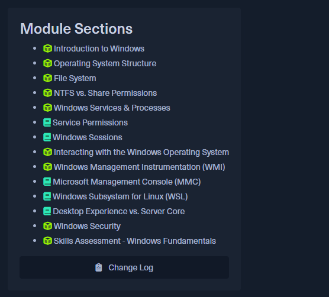

## Introduccón a HackTheBox

**HackTheBox** es una plataforma dedicada a mejorar el conocimiento de ciberseguridad para cualquier estudiante que lo desee. Fue creada en  **2017**
 y desde ese entonces han implementado diversas funcionalidades útiles, como: **HTB Labs** (laboratorios para hackear con entornos simulados), **HTB Academy** (del cual hablaremos hoy), **HTB CTF** (competencias de Hacking) y **HTB Enterprise Plataform** (orientada a empresas).

**HackTheBox** cuenta por su parte con financiación de diversas organizaciones, incluso a inicios del presente año, se asociaron con Google para fomentar la ciberseguridad sobre la **IA**.

## HTB Academy: Estructura

**HackTheBox Academy** es una academia como su nombre indica, para aprender ciberseguridad, sus curso estan estructurados por Paths: que no son mas que categorias que contiene modulos orientados hacia ciertos temas, por ejemplo, el Path Information Security Basics incluye:

### <u> Information Security Basics</u>  
**• Intro to Academy**  
**• Learning Process**  
**• Setting Up**  
**• Linux Fundamentals**  
**• Windows Fundamentals**  
**• Introduction to Windows Command Line**  
**• Introduction to Bash Scripting**  
**• Introduction to Networking**  
**• Intro to Network Traffic Analysis**  
**• Intro to Active Directory**  
**• Introduction to Web Applications**  
**• Web Request**  

Como vemos, el Path Information Security Basics esta conformado por distintos modulos que abarcan temas específicos.  

Cada modulo esta dividido en secciones que abarcan subtemas, ejemplo:

 ##### (Secciones del Modulo Windows Fundamentals).  
   
Las secciones no son mas que paginas que abarcan el subtema en forma de texto, aunque tambien pueden presentar ejercicios para probar tus habilidades mediante la conexión a una maquina virtual remota. Por lo general, los modulos son largos y pueden ocupar días en completarse, incluso dedicandole mas de 4 horas al día; el promedio de duración por modulo es de aproximadamente 3-4 días. Recomendamos leer la documentación de la pagina antes de realizar algún modulo.

## Nuestro Review

 

- **Modular components**: Easily customizable sections and layouts
- **Accessibility built-in**: Ensuring your site works for everyone
- **SEO optimization**: Helping your content rank better in search engines
- **Modern design principles**: Clean, responsive layouts that look great on any device

Titan Core provides the essential structure and components that power all our specialized themes, ensuring consistency, quality, and reliability across our entire catalog.

## Our Theme Roadmap

We're excited to be developing a comprehensive suite of specialized themes to meet various website needs:

- **Agency**: Perfect for creative agencies and service businesses
- **Portfolio**: Showcase creative work with beautiful galleries and project pages
- **Recipes**: A specialized theme for food blogs and recipe collections
- **Design**: For design studios and creative professionals
- **Personal Blog**: Simple, elegant layouts for writers and content creators
- **Personal Resume**: Showcase your skills and experience with a professional online presence
- **Marketing**: Conversion-focused designs for products and services

Each theme builds upon our Titan Core foundation while adding specialized features, layouts, and design elements tailored to specific use cases.

## Our Commitment

At Titan Studio Themes, we believe in:

1. **Quality over quantity**: Each theme is meticulously crafted with attention to detail
2. **Continuous improvement**: Regular updates and new features based on user feedback
3. **Excellent documentation**: Comprehensive guides to help you make the most of our themes
4. **Responsive support**: We're here to help when you need assistance

Whether you're a developer looking for a solid foundation to build upon, or a business owner seeking a turnkey solution, Titan Studio Themes provides the tools you need to create exceptional websites with Astro JS.

## Join Our Journey

We're just getting started, and we invite you to join us on this exciting journey. Sign up for our newsletter to be the first to know about new theme releases, special offers, and helpful Astro JS tips and tricks.

Ready to transform your web presence? Explore our themes and discover the perfect solution for your next project. 