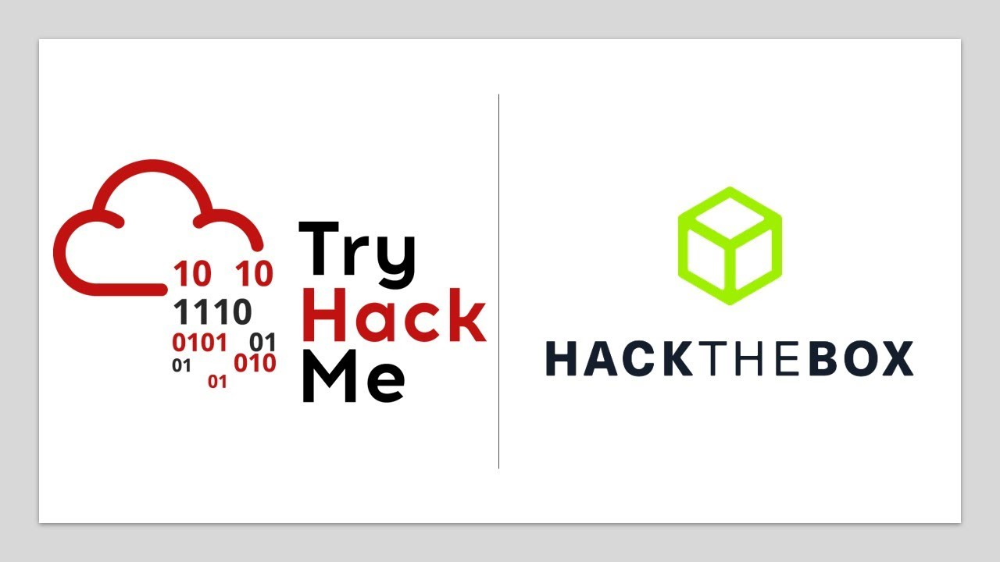

## **Introducción a HackTheBox**

 <b>HackTheBox</b>  es una plataforma dedicada a estudiantes para mejorar el conocimiento en ciberseguridad. Fue creada en  <b>2017</b>  y desde ese entonces han implementado diversas plataformas integradas útiles como: <b>HTB Labs</b>  (laboratorios para hackear con entornos simulados),  <b>HTB Academy</b> (del cual hablaremos hoy),  <b>HTB CTF</b> (competencias de Hacking) y  <b>HTB Enterprise Plataform</b>  (orientada a empresas). 

  <b>HackTheBox</b>  cuenta por su parte con financiación de diversas organizaciones, incluso a inicios del presente año, se asociaron con <u>Google</u> para fomentar la ciberseguridad sobre la  <b>IA</b> .

## **HTB Academy: Estructura**

 <b>HackTheBox Academy</b>  es una academia como su nombre indica, para aprender ciberseguridad, sus curso estan estructurados por Paths: que no son mas que categorías que contienen módulos orientados hacia ciertos temas, por ejemplo, el <b>Path Information Security Basics</b> incluye:

### <u> Information Security Basics</u>  
**• Intro to Academy**  
**• Learning Process**  
**• Setting Up**  
**• Linux Fundamentals**  
**• Windows Fundamentals**  
**• Introduction to Windows Command Line**  
**• Introduction to Bash Scripting**  
**• Introduction to Networking**  
**• Intro to Network Traffic Analysis**  
**• Intro to Active Directory**  
**• Introduction to Web Applications**  
**• Web Request**  

 Como vemos, el<b> Path Information Security Basics </b>esta conformado por distintos módulos que abarcan temas específicos.  

**Cada módulo esta dividido en secciones que abarcan subtemas, ejemplo:**

 #####  (Secciones del Modulo <b> Windows Fundamentals </b>).   
   

 Las secciones no son mas que páginas que abarcan el subtema en forma de texto, aunque tambien pueden presentar ejercicios para probar tus habilidades mediante la conexión a una máquina virtual remota. Por lo general, los módulos son largos y pueden ocupar días en completarse, incluso dedicandole mas de 4 horas al día; <u>el promedio de duración por módulo es de aproximadamente 3-4 días</u>. Recomendamos leer la documentación de la página antes de realizar algún módulo.

##  **Nuestro Review**

 Para dar un Review acerca de la plataforma será importane considerar varios aspectos sobre la modalidad de las clases como la calidad, claridad de los textos, enseñanza teórica y práctica, contenido, dificultad y ventajas y desventajas.

### **Calidad**  

 Realmente es un buen curso que cuenta con una buena calidad de recursos para practicar y aprender, como podrían ser máquinas virtuales, una explicación muy bien estructurada y una plataforma demasiado funcional, probablemente uno de los pocos inconvenientes que puedas tener con la página es que suelen sobrecargarse las máquinas virtuales y las  <b>VPN</b>  para conectarse a ellas en horarios de mediodía, en caso de México es normal que se trabe entre las <u>12:00 p.m y 3:00 p.m</u>, ya que la página se encuentra en esos momentos con la mayor cantidad de usuarios en el día.  

  

 

#### Calificación: 9.5/10
 

### **Claridad**  

 <u>El contenido es decentemente claro</u>, sin embargo muchos usuarios afirman y por experiencia, yo igualmente coincido en que en ocasiones falta explicar cosas y no hay siquiera espacios donde dejen documentación extra, que yo como cursante siempre la leía. Es cierto que la página en su introducción dice que se debe investigar más por afuera, pero en mi opinión, ciertos temas que abarcan tienen cierta incompletitud en su explicación. Es de admitir para quien tome el curso que muchas veces existiran situaciones muy frustrantes en que los ejercicos incluyan cosas que o no son posibles con las herramientas explicas que no se han enseñado; incluso ejercicos posibles, pero que incluyen resolver problemáticas extras las cuales no han sido tratadas. 

#### Calificación: 8.5/10 
 

### **Enseñanza teórica**

  <b>HackTheBox</b>  enseña demasiado sobre el aspecto teórico, es un aspecto en lo cual nunca fallará.  <b>HackTheBox</b>  no solamente da tutoriales de como hacer las cosas, sino que se expande en la teória sobre como es que funciona por detrás cada herramienta, comando, etc; logrando un entendimiento suficiente en el aspecto teórico; es uno de los puntos mas fuertes de la plataforma.

#### Calificación: 10/10

### **Enseñanza practica**

 <b>HackTheBox</b> no se queda atrás en este aspecto, pues ofrece como ya antes mencionado máquinas virtuales, así como ejercicos que tendrás que hacer en ellas para contestar preguntas las cuales te permitirán pasar a la siguiente sección como requisito obligatorio, además de dejar ejercicios opcionales para probar las herramientas o comandos los cuales van explicando, dejando un <u>conocimiento robusto en el aspecto práctico</u>, pues los retos pueden ser tanto faciles como dificiles y frustrantes, sin embargo, se sabe que te dejan una preparación increible.
 
 

 PD: Uno de los mejores aspectos de la enseñanza practica, es que puedes usar 2 horas al dia una máquina virtual de ellos por medio de la misma web, evadiendo la necesidad de conectarte por medio de una <b>VPN</b> tu mismo, es recomendable usarlo cuando se pueda, ya que suele ser mas comodo en mi opinión y claro, te ahorras tener una <b>VM</b> propia corriendo en otra ventana.

#### Calificación: 10/10

### **Contenido**

 La página no flaquea en este aspecto, tiene un <u>contenido demasiado amplio</u>, es cierto que se le crítica que ciertos temas a veces no terminan de explicarlo y se tiene que recurrir a la web, no obstante, no resta que cada módulo contenga una amplia variedad de temas en los que de forma extendida se trata cada uno de ellos, la mayoría incluyendo ejercicios. Uno de los cursos mas completos en mi opinión.
 

 Es cierto que el contenido puede ser muy pesado y frustrante, por lo que siempre se recomienda haber tomado entrenamiento en ciberseguridad básico previamente.

#### Calificación: 9.5/10

### **Dificultad**

  <b>HackTheBox</b>  es una plataforma que a diferencia de  <b>TryHackMe</b>, <u>no es tan apropiado para principiantes</u> como mencionado en el anterior aspecto, a pesar de eso, puede llegar a ser igualmente frustrante para un practicante intermedio, tendrás que lidiar al momento de los cursos con errores en los programas no previstos, errores que uno mismo comete con el syntax de comandos, algunos programas no compatibles, complicaciones con la máquina virtual, etc; así que es necesario estar consciente que es un paso importante para aprender, pero que realmente puede jugar muchas malas pasadas.

 

 La dificultad para un estudiante la rankeamos como:

#### Dificultad: 9/10

 

### **Ventajas y desventajas**

#### **Ventajas**
**• Contenido muy extenso**  
**• Laboratorios para practicar**  
**• La comunidad es extensa y ofrece muy buen apoyo**  
**• Máquinas virtuales integradas en la misma Web**  
**• Enseñanza teórica y práctica suficiente**  
 

#### **Desventajas**

**• No ofrece enseñanza por medios audiovisuales mas que los apoyos gráficos**  
**• A veces las explicaciones no son del todo completas y hace falta investigar, aunque es solucionable**  
**• No es apto para principiantes**  
**• Las máquinas virtuales o VPN suelen tener una considerable sobrecarga en ocasiones**  
**• Hay programas no compatibles con el OS Recomendado por ellos \(Parrot\), por lo que a veces hay que buscar metodos alternativos para conseguirlos**  
 
 

## **Consejos y Conclusión**

 Es una buena plataforma, la cual recomiendo de forma amplia debido a que en conjunto con todos los aspectos analizados realmente te prepara para empezar a practicar con entornos simulados herramientas de Hacking, por lo que le damos una calificacion final de <u>  <b>9.75</b>  </u>
 

  

 

 Para terminar, es importante aclarar que el curso está originalmente en Ingles, que es necesario saberlo, ya que la mayoria de documentacion y recursos en este mundillo se encuentra en ingles. De todos modos, se puede traducir la página con el único inconveniente es que a veces el traductor puede traducir erroneamente comandos, herramientas, etc; generando así posibles textos erróneos. 
